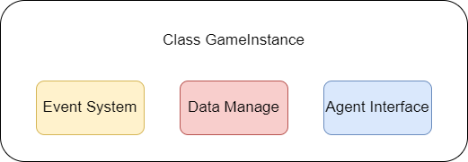
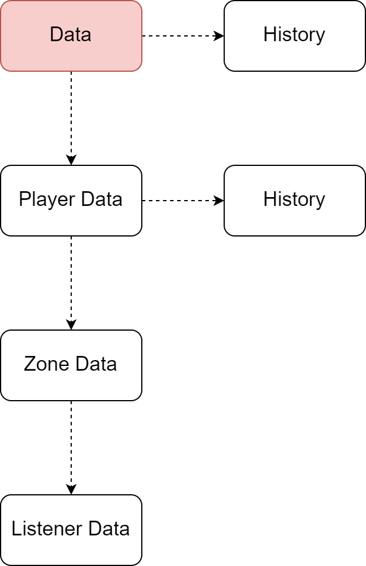

## Overview

整个引擎组成大概如下:



## Data Manage

GameInstance中的数据是高度层次化的, 如图



History中储存了特定于该层次的一些状态变量. 例如, 顶级Data中储存了整局游戏的某些状态(先后手等); 而PlayerData中储存的则是例如该Player本局内是否有角色阵亡等.

### Data(GameData)

GameData由两部分组成.

1. History
2. Player0 和Player1的PlayerData

GameData的History包括以下内容:

1. 现在是第几回合
2. 现在是谁的行动轮次
3. 现在是什么阶段(换牌, 掷骰, 行动, 开始, 结束)
4. 胜利者为哪一方(或还未结束)

我们使用0或者1来标记player(通常, 0是先手方). -1表示还未结束.

### PlayerData

PlayerData包含History和属于该Player的所有ZoneData

PlayerData的History包括:

1. player_id
2. 出战角色下标
3. 是否结束回合
4. 下次普通攻击是否为下落攻击
5. 本回合内是否有角色阵亡

Player使用一个向量保存对所有Zone的引用. 其下标对应zone_id.

### ZoneData

Zone是一个相对复杂的概念. 它指代七圣召唤中的七个区域: 牌堆, 手牌, 支援区, 召唤区, 角色区, (阵营)状态区和骰池.

我们将角色区和状态区进行了区分, 这是因为游戏的结算逻辑中, 角色区和阵营状态区的优先级不同. 

每个Zone特有的数据格式都不一样. 

所有Zone都被限定在namespace Zone下, 以避免命名冲突.

#### Pile

Pile指的是牌堆. 

Pile包含一个卡牌实例列表. 这些实例主要的作用是提供tags以便检索.

Pile完全是乱序的.

#### Hand

Hand指手牌.

Hand中包含一个监听器列表, 每个监听器都是一个卡牌实例. 我们会在之后的Event System中详细叙述监听器是什么. 在这里, 只需记住, cgisim中所有可以交互的单位都被视作Listener, 而他们的交互手段是Event.

卡牌需要实现draw和enterpile方法. 前者会在被抽取时调用, 后者会在开局, 以及重新返回牌堆(换牌后)被调用.

Hand的最大容量为10.

#### SupportZone, SummonZone

这是两个非常相似的区域. Support和Summon都只允许容纳至多四个监听器. 它们之间有以下不同:

1. Support可以将原有的支援替换掉, 添加新支援. Summon不行
2. Summon可以刷新同名召唤物, Support不行. 

#### DicePool

骰池也是一个相当简单的区域. 它保存一个向量, 每一位表示某种元素的数量.

#### BuffZone

阵营状态区包含一列不限数量的监听器. 这里几乎是定义最薄弱的地方, 没有任何限制.

#### CharZone(CharacterZone)

CharZone保存三个(理论上应当可以支持多个, 但我们主要面向"标准"的七圣召唤场景)角色(Listener::Character)监听器. 

我们将角色定义为一种特殊的监听器. 

### Data Addressing

数据寻址是游戏中十分重要的一部分. 我们从上面可以看出, 想要寻找一个data, 需要经过Game-Player-Zone-Listener的四级结构(而Listener内部也可能有结构).

由于Game人尽皆知, 所以我们可以省略这一部分. 在此基础上, 寻址系统至多支持找到Listener. 

```cpp
struct Address{
    int player_id;
    int zone_id;
    int index;
}
```

前两个变量是不言自明的; 最后一个变量指明了该Listener在Zone内的偏移. 将该Address传递给寻址系统后, 寻址系统将返回该Listener的**引用**. 随后, 你就可以自行搜索内部数据.

> zone_id将在Macro中详述.

需要说明的是, 寻址系统不支持Pile和dicepool. 因为它们内部是乱序的.

你可以通过`GameInstance::get(address)`来执行寻址.

#### CharZone Addressing

CharacterZone是一个较特殊的区域, 它有内置结构. 因此CharacterZone内部也有一个寻址系统

```cpp
struct CZAddr{
    int char_index;
    int subzone;
    int offset;
}
```

`subzone`指明是武器, 圣遗物, 天赋还是角色状态. offset仅对角色状态有效. 具体请参见Zone::Character类的介绍.

### Macro

七圣召唤中有许多概念十分类似. 我们使用宏来统一它们.

element:

```cpp
namespace element{
    pyro = 0,
    ....
    omni = 7,
    empty = 7,
    physical = 7,
    pierce = 8,
    cryodendro = 8,
    died = 9
};
```

这样排列的好处在于, dicepool可以使用数组而非字典储存(正好是一个长为8的定长数组), 加快访问速度. 

cryodendro用于描述冰草共存这种特殊情况. died用于表示该角色死亡(这会影响到扩散的计算). died和empty意义并不一样(主要是扩散).

physical和pierce是特定于伤害类型的描述词.

使用宏统一后, 我们在描述伤害, 附着, 角色元素等可以使用同一套描述符, 省去了类型转换的麻烦.

zone_id:

```cpp
namespace Zone{
    charzone_id = 0;
    teambuffzone_id = 1;
    summonzone_id = 2;
    supportzone_id = 3;
    handzone_id = 4;
    dicepool_id = 5;
    pilezone_id = 6;
}
```

这些id按照监听器响应顺序自然排列. 顺带一提, 每个Zone的类中都有一个`zone_id`, 它们与Zone::XXXzone_id完全一致.

## Event System

七圣召唤中有非常明显的事件痕迹, 大多数效果通过观察某种事件而被触发. 因此, 我们使用这种基于事件的设计. 

### Event Interaction

基于Event的交互流程如下:

TODO: 这里需要一张图

#### 状态机

七圣召唤被定义为一个状态机$\mathcal{M} = \{\mathcal{S}, \mathcal{E}\}$, 状态机$\mathcal{M}$上有一个转移函数$E:\mathcal{S}\times \mathcal{E}\rightarrow \mathcal{S}\times \mathcal{E}^n$. 我们用一个简单的记号$S(e)$表示状态$S\in\mathcal{S}$经过事件$e\in \mathcal{E}$后的新状态. $E_{S(e)}$表示转移过程中产生的新事件. 特别地, $\varepsilon$表示一个空事件, 即什么也不做.

这样表述下的状态机十分复杂, 因为它包含了很多中间状态. 我们定义**稳定状态**集$\Phi$, 它满足: $\forall s\in \Phi$, $s(\varepsilon) = s$. 即该状态的空转移是它自身(不会自动发生变化). 为了符号简便, 在不致歧义的场景下, 我们用$\mathcal{S}$指代稳定状态集.

稳定状态之间也存在转移函数. 此时, 各稳定状态之间的转移不再以事件为描述单位, 而是一个事件序列, 我们将其称为指令Instruction. 在实际情况中, Instruction就等于用户指令, 它会被翻译成事件序列. 即$\mathcal{M} = \{\mathcal{S},\mathcal{I}\}$.

模拟器会保证在执行一条Instruction前后都是稳定状态.

稳定状态实际上也有很多. 为此, 我们定义**Phase**概念. 对于Phase $P = (\{s\}, E_P)$, 它满足, $\forall s \in P, \exist s', s'(e) = s, e\in E_P$. 即同一Phase内的状态源于同一个事件集. 

> 实际上, 如果我们虚拟一些中间状态, 例如新建一个状态S0, 在其上定义一个转移函数: 当遇到Ep中的事件时, 产生某个特定事件(类似于发信号); 则可以将事件集归结为单一事件. 这在数学上会比较方便, 但是编程中会带来不必要的开销.

目前模拟器中定义了如下几种Phase:

```
GameStart: 先后手
RollPhase: 掷骰
HandSwitch: 换手牌
RoundStart: 结算开始效应
Combat: 执行各类战斗行动
RoundEnd: 结算回合末效应
DeathSwap: 死亡后切换
```

这么划分的原因是, 对于任何一个状态, 它们一定至少属于以上Phase之一. 但是并非所有Phase都包含稳定状态, 例如RoundEnd和RoundStart就并不包含任何稳定状态. 

$E_P$被称为信号事件集, 即收到这些事件后将会发生Phase切换. 它们实际上形成了一个状态转移函数, 其中状态为Phase.

在模拟器中, 我们实际维护的状态变量是Phase.


### Event


### 事件队列

七圣召唤中的事件并不完全以队列形式出现. 其伪代码如下:

```
while q not empty:
    event = q.pop(0)
    elist = []
    for L in listeners:
        ret_list = L.listen(event)
        elist.extend(ret_list)
    execute(event)
    if event is not over:
        elist.append(over(event))
    q = elist + q
```

值得一提的是, 本质上来说七圣召唤的事件形成的是一个事件树, 而时序遍历本质上是自左向右遍历(这和LALR是一个顺序); 不过七圣的事件树是动态事件树, 并且从树的递归遍历中恢复会比较麻烦.

#### 中断

七圣召唤中有一个很特殊的情况: 死亡切换. 即, 一方有角色阵亡时, 如果该角色是出战角色, 那么将会强制中断进程, 让牌手选择出战角色(形成一个切人).

为了支持这种情况, 事件系统必须要能处理中断. 很显然, 中断一定发生在execute. 又, 事件是一个原子操作, 所以中断一定可以被平移到execute之后(就算发生在execute内部). 所以我们修改以上代码:

```
while q not empty:
    do_events()
    interrupt = execute(event)
    if interrupt:
        raise_interrupt(interrupt)
        save_queue(q)
        break
    //other code is same as above
```

`raise_interrupt`可能只是修改了某个状态变量, 我们在这里只是用伪代码表达意义.

现在我们可以保存住中断现场了. 我们还需要从中断中恢复的能力. 为此我们增设一个`recover`变量.

```
if recover:
    q = load_queue()
    recover = false
while q not empty:
    //.....
```

在实际情况中, 中断会设置GameInstance的phase变量为`DEATH_SWAP`. 这是一个稳定状态, 需要等外部(玩家)输入指令后才会继续执行. 

### 监听器

一个监听器Listener包含以下内容:

1. 地址Addressing, 用于确认自身位置. 这个值只能通过外部类(通常是Zone)进行维护.
2. 方法`listen(Event e, GameInstance* g)`. 该方法被框架直接调用. 该方法会调用过滤器以屏蔽不相关事件.
3. 方法`virtual vector<Event> handle(Event* e, GameInstance* g)`. 该方法处理事件. 此方法必须由子类实现, 是一个纯虚函数.
4. 虚方法`vector<Filter>& get_filters()` Filter是过滤函数指针, 用于屏蔽不相关事件. 该函数存在一个默认构造, 返回一个InvalidFilter.`using Filter = bool (*)(Event* e)`

#### handle

handle接收一个事件指针, 一个游戏实例指针并执行相应逻辑; 它返回该事件会引起的其他事件构成的列表. 

大部分监听器需要做的其实只是修改传进来的事件指针(的内容). 使用这种方式传递有利于事件源追踪事件进程.

